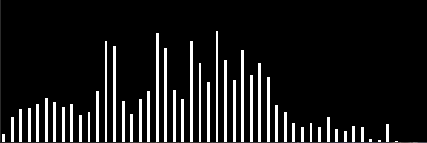
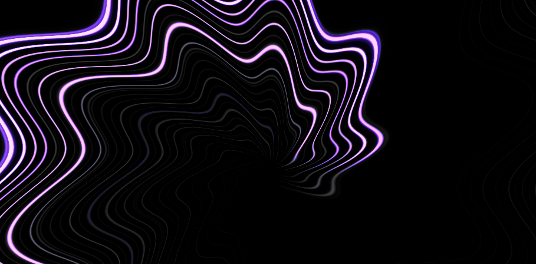

# About
Welcome to the project page for my music visualizer :)

Here is a comparison between what my app looks like and what other music
visualizers might look like when visualizing the same sound.


# Building

First get the sources
```
git clone --recursive https://github.com/xdaimon/music_visualizer.git
```
Then to build on Ubuntu
```
sudo apt install cmake libglfw3-dev libglew-dev libpulse-dev
cd music_visualizer
mkdir build; cd build; cmake ..; make -j4
```

and on Windows 10 with Visual Studio 2017:
```
build the x64 Release configuration
```

# Viewing Shaders

Code for shaders should be located in a folder named shaders that is in the same directory as the executable.

A shader.json file gives you some control over the rendering process. Here is a minimal shader.json.
```
{
	"image":{
		"geom_iters":1
	},
}
```
This will create a shader that expects the following file layout
```
executable
shaders/
    image.frag
    image.geom
    shader.json
```
The app sends a number of points to a geometry shader which the user can write. This allows the user to draw any kind of procedural geometry, not just fullscreen quads. The procedural geometry generated in image.geom is then shaded by the user provided fragment shader in image.frag.

Here is a more complete example displaying all the options available in shader.json
```
{
	"initial_window_size":[500, 230],

	"image":{
		// "size": image is always the same size as the window
		"geom_iters":1, // knumber of points that are sent to the geometry shader.
	},
	"buffers":{
		"A":{ // compute a blur
			"size": "window_size", // pixel size of A's framebuffer
			"geom_iters":1,

			// Color values are floating point values in the range [0, 1]
			// Default is [0, 0, 0]
			"clear_color":[0, 0, 0]
		},
		"B":{ // render geometry into B's framebuffer
			"size": [200, 200],
			"geom_iters":50, // maybe 50 rectangles in 3D
			"clear_color":[1.0, 0, 0] // on a red background
		}
	},

	// Every buffer has access to the most recent output of all buffers
	// The contents of a buffer are available as a sampler named i{BuffName}
	// So, to fetch the contents of A you could do texture(iA, uv);

	// Default is the order the buffers are declared above
	"render_order":["A", "B"],

	// blend output of fragment shader with framebuffer based on alpha?
	// uses glBlend(src alpha, one minus src alpha)
	// which is mix(old_color.rgb, new_color.rgb, new_color_alpha)
	// Default is false
	"blend":true,

	// Enable the audio thread? This could cause higher system load.
	// Default is true
	"audio_enabled":true,

	// Defaults are true, true, .75, .75
	"audio_options": {
		"fft_sync":true,
		"diff_sync":true,
		"fft_smooth":0.5, // not implemented yet
		"wave_smooth":0.8
	},

	// Available as {UniformName} in all buffers.
	// Useful for setting colors from external scripts.
	"uniforms": {
		"my_uni":[10, 123, 42], // a vec3 available in each buffer
		"your_uni":[25, 20, 1],
		"his_uni":[1.0, 2.0, 3.0, 4]
	}

}
```
This shader would expect the following file layout
```
executable
shaders/
    A.frag
    A.geom
    B.frag
    B.geom
    image.frag
    image.geom
    shader.json
```

If you modify the shader's code or shader.json while the app is running, then the app will load your changes, recompile the shaders, and render the new shaders if everything compiled correctly.

# TODO

Default values need attention:

What if the user doesn't provide image.geom? Should I assume they want a fullscreen quad to shade in image.frag?

What if the user does not provide shader.json? What should I assume then?

I am not sure there is a good solution without making assumptions about how people use my app.

# Thanks To

<a href="https://github.com/linkotec/ffts">ffts</a>
	Fast fft library<br>
<a href="https://github.com/karlstav/cava">cava</a>
	Pulseaudio setup code<br>
<a href="https://github.com/kritzikratzi/Oscilloscope">Oscilloscope</a>
	Shader code for drawing smooth lines<br>
<a href="https://github.com/shadowndacorner/SimpleFileWatcher">SimpleFileWatcher</a>
	Asyncronous recursive file watcher<br>
<a href="https://github.com/rapidjson/rapidjson">RapidJson</a>
	Fast json file reader<br>

# Examples

Here is a youtube video of the app displaying a waveform.<br>
<a href="https://youtu.be/yxGM7H1RFRA">https://youtu.be/yxGM7H1RFRA</a>






